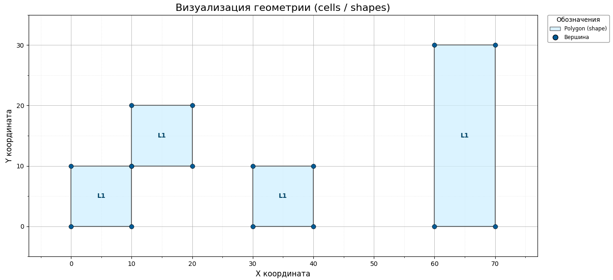

# ITMD-03

### Лабораторная работа №3: Разработка алгоритма выявления нарушений КТО на базе метода сканирующей прямой

### Цель работы:
Изучение алгоритма сканирующей (заметающей) прямой и получение практических навыков разработки логики для поиска геометрических нарушений проектных норм (DRC).

### Задание №1. Выявление нарушений: касание в точке

1. Взять JSON-файл из предыдущих работ, внести в него ряд изменений, приводящих к появлению нарушения **«Касание полигонов в одной точке»** (corner-to-corner touching). Касание для ортогональных полигонов возможно "углами". Сохранить файл под именем `test_schema.json`.
2. Изучить предоставленный базовый "каркас" алгоритма сканирующей прямой (`sweepLine.py`). Каркас реализует движение вертикальной прямой по оси X слева направо и генерирует событие при встрече с каждой вершиной полигона.
3. Разработать логику выявления конкретного нарушения: **«Касание полигонов в одной точке»** (corner-to-corner touching). Для этого необходимо выполнить соответствующие доработки базового каркаса в функции  внутри функции-коллбэка `detect_point_contact`, которая инжектируется в каркас. По результатам проверки формируется файл `student_predictions.json`.

### Пример работы реализованного алгоритма:

Обрабатывалась топология из файла ```test_schema.json```

Визуальное представление:



Результат представлен в файле ```student_predictions.json```

### Задание №2. Выявление нарушений: малая величина зазора между полигонами

1. Взять JSON-файл из предыдущих работ, внести в него ряд изменений, приводящих к появлению нарушения **«Малая величина зазора между полигонами»**. Сохранить файл под именем `test_schema.json`.
2. Переработать алгоритм сканирующей прямой для выявления нарушений, связанных с малой величиной зазора. Для этого нужно связать события так, чтобы образовалась цепочка и текущее событие могло обратиться к предыдущему и к последующему. При изменении координаты Х можно рассчитать расстояние между паралелльными ребрами. Повторить тоже самое для координат Y, то есть сформировать новую цепочку связанных событий и запустить сканирующую прямую снизу вверх (или сверху вниз). В результате, получить расстояния между параллельными ребрами и найти пары, расположенные слишком близко друг к другу. По результатам проверки формируется файл `student_predictions.json`. 
3. Разработать способ визуализации нарушений на основе информации в файле `student_predictions.json`.


### Состав отчёта:
1. Титульный лист;
2. Формулировка задания;
3. Доработанный файл `sweepLine.py` для задания №1;
4. Изображение обрабатываемой топологии ИС для задания №1;
5. JSON файл с найденными ошибками для задания №1;
6. Доработанный файл `sweepLine.py` для задания №2;
7. Изображение обрабатываемой топологии ИС для задания №2;
8. JSON файл с найденными ошибками для задания №2;
9. Изображение с найденными нарушениями для задания №2ж
10. Вывод по работе.
